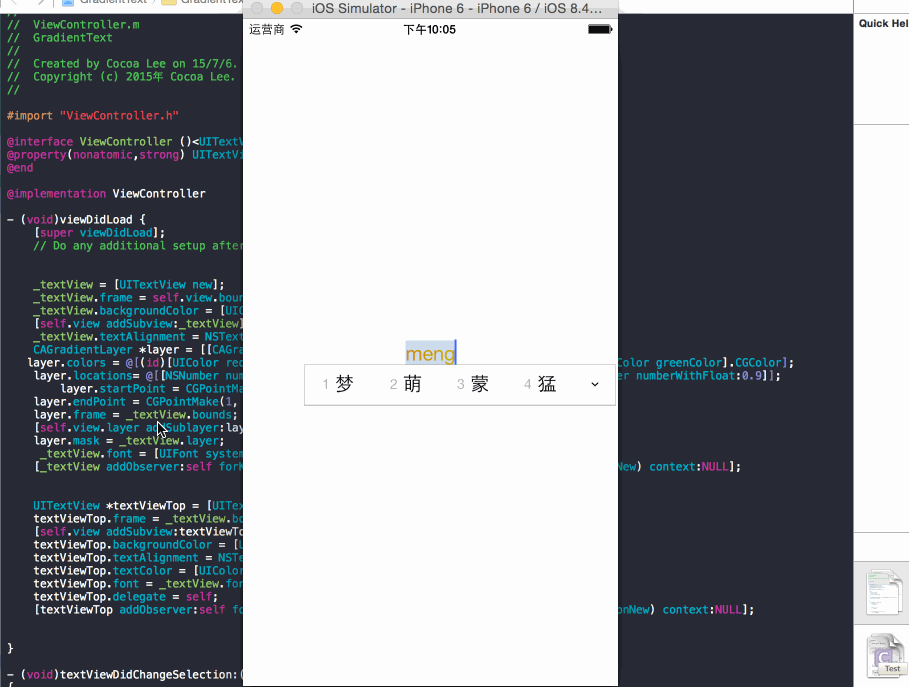

###GradientText_Objective-C  渐变文本

今天看到  @周楷雯Kevin 开源了一份渐变文本的源码 ( Swift 版 )，晚上闲来无事做了一个 Objective-C 版

感谢[@ 周楷雯 Kevin －－ Swif t版](https://github.com/kevinzhow/RealtimeGradientText) 

###原理
[渐变文本原理祥见－－@周楷雯 Kevin 的 Blog ](http://blog.zhowkev.in/2015/07/06/fun-with-mask/)
